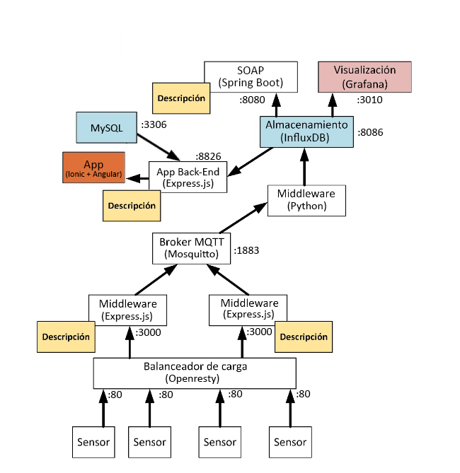

# Mosquitto testing

[](https://opensource.org/licenses/Apache)

## Tabla de contenidos

- [Tabla de Contenidos](#tabla-de-contenidos)
- [Objetivos](#objetivos)
- [Sensor Middleware](#sensor-middleware)
    - [API Reference](#api-reference)
    - [Variables de entorno](#variables-de-entorno)
- [Documentación](#documentación)
    - [Docker compose doc](#docker-compose-doc)
    - [Additional doc](#additional-doc)

## Objetivos

El objetivo de este proyecto es implementar una red orientada a servicios, que no alcance la
congestión de manera estructural, y que por lo tanto sea capaz de gestionar todas las peticiones
que le llegan desde una plataforma de sensores hardware. La red se orientará a un paradigma
de encaminamiento de publicación/suscripción, deberá ser fiable o persistente, y deberá incluir al
menos cuatro servicios.



## Sensor middleware

### Test sensor middleware

```shell

curl --location --request POST 'localhost/data' \
--header 'Content-Type: application/json' \
--data-raw '{
    "sensor_id":"nodoPrueba1",
    "temperature":24.5,
    "humidity":68.2,
    "co2":293,
    "volatile":112
}'

```

### API Reference

| Ruta  | Metodo | Respuesta                    |
|-------|--------|------------------------------|
| /test | GET    | Hello from Sensor Controller |
| /data | POST   | 200 OK                       |

### Variables de entorno

| Nombre    | Valor por defecto   |
|-----------|---------------------|
| PORT      | 3000                |
| MOSQUITTO | topico de mosquitto |
| ...       | ...                 |

## Documentación

Seccion con referencias, y comandos

### Docker compose doc

```shell
# Run the test infrastrucuture
docker compose up -d
```

```shell
# Run the replicated infrastructure
docker compose -f docker-compose.replicated.yaml up -d
```

### Additional doc

Usefull commands for mqtt testing

```shell
#publish to topic test 
mosquitto_pub -h 127.0.0.1 -t test -m "hola"

#subscribe to topic test
mosquitto_sub -h 127.0.0.1 -t test
```
